# JoinUs

## Table of contents

- [How to Use](#how-to-use)
- [Code Conventions](#code-conventions)
- [Dependencies](#dependencies)
- [Code structure](#code-structure)
- [Database diagram](#database-diagram)
- [Screenshot](#screenshot)

## Prerequisites

- Flutter: >=3.7.0 <4.0.0
- [Firebase staging](https://console.firebase.google.com/u/0/project/flutter-app-ec8dd/settings/iam)
- [Firebase prod](https://console.firebase.google.com/u/0/project/template-app-prod-3a034/settings/iam)

## Link
- [Firebase console](https://console.firebase.google.com/u/0/project/see-joy-3f334/overview)
- [Tasks - Trello](https://trello.com/b/szWc2iq1/join-us-project)
- [Source code - Github](https://github.com/luke-nguyen-goldenowl/join_me)

## How to Use

- **Step 1:** Download or clone this repo by using the link below:

  ```sh
  https://github.com/luke-nguyen-goldenowl/join_me.git
  ```

- **Step 2:** Install Flutter

  - Install the platform-specific SDK [here](https://flutter.dev/docs/get-started/install)

- **Step 3:** Setup flutter and run locally

  - Go to project root and execute the following command in console to get the required dependencies:

    ```sh
    flutter pub get
    ```

  - Connect your physical device or open simulator. then run your app
    ```sh
    flutter run
    ```

- **Step 4:**
  This project uses inject library that works with code generation, execute the following command to generate files (re-run every time you change one of these files)

  - Firstly, If you have not install flutter_gen yet. [Click here](https://pub.dev/packages/flutter_gen#installation)

  - Secondly, generate files for packages that use build_runner (auto_route, freezed...)

    ```sh
    flutter pub run build_runner build --delete-conflicting-outputs
    ```

- **Step 5:** Download the gitignore files [here](https://drive.google.com/drive/folders/1GbEW6A1SmxP5UmCMYMyMGcCVr-OzuabY?usp=sharing) and put them in the correct folder according to the structure below :


```
flutter-app/
|- .vscode/
  |- launch.json
  |- settings.json
|- android
  |- key.properties
|- .env
```

- **Step 6:** Execute the following command to build app:

  ### Android:

  1. Change version and build number in `pubspec.yaml`

     ```
     flutter build appbundle
     ```

  2. Or run command line below to build with your build version

     ```
     flutter build appbundle --build-name=1.2.0 --build-number=2
     ```

  3. Access [Play console](https://play.google.com/console/u/0/developers) to create a new release and upload your build


## Code Conventions

- [analysis_options.yaml](analysis_options.yaml)
- [About code analytics flutter](https://medium.com/flutter-community/effective-code-in-your-flutter-app-from-the-beginning-e597444e1273)

  In Flutter, Modularization will be done at a file level. While building widgets, we have to make sure they stay independent and re-usable as maximum. Ideally, widgets should be easily extractable into an independent project.

- Must know
  - Model name start with `M`: MUser, MProduct, MGroup...
  - Common widget start with `X`: XButton, XText, XAppbar... - These widgets under folder `lib/widgets/`
  - App Constants class or service start with `App`: AppStyles, AppColor, AppRouter, AppCoordinator,.. and UserPrefs

## Dependencies

- [flutter_bloc](https://pub.dev/packages/flutter_bloc) A dart package that helps implement the BLoC pattern. Learn more at [bloclibrary.dev](https://bloclibrary.dev/#/)!

- [go_route](https://pub.dev/packages/go_route) It’s a Flutter navigation package

- [flutter_gen](https://pub.dev/packages/flutter_gen) The Flutter code generator for your assets, fonts, colors, … — Get rid of all String-based APIs.

- [image_picker](https://pub.dev/packages/image_picker) A Flutter plugin for iOS and Android for picking images from the image library, and taking new pictures with the camera.

- [google_maps_flutter](https://pub.dev/packages/google_maps_flutter) A Flutter plugin that provides a Google Maps widget.

- [geocoding](https://pub.dev/packages/geocoding) A Flutter Geocoding plugin which provides easy geocoding and reverse-geocoding features.

- [geolocator](https://pub.dev/packages/geolocator) A Flutter geolocation plugin which provides easy access to platform specific location services

## Code structure

Here is the core folder structure which flutter provides.

```
flutter-app/
|- android
|- ios
|- web
|- lib
|- modules
|- test
```

Here is the folder structure we have been using in this project

```
lib/
|- packages/
|- src/
  |- data/
  |- services/
  |- feature/
    |- account/
      |- profile/
    |- add_event/
    |- authentication/
    |-common/
    |- dashboard/
      |- widget/
      |- logic/
      |- view/
        |-dashboard_screen.dart
    |- detail_event/
    |- event/
    |- followed/
      |- upcoming/
      |- past/
    |- force_update/
    |- home/
      |- widget/
      |- logic/
      |- view/
        |-home_screen.dart
      |-story
    |- manage_event/
      |- edit_event/
      |- manage_event_detail/
    |- notification/
    |- photo_view/
    |- profile_other_user/
    |- sample/
    |- search/ 
  |- plugins/
  |- router/
  |- network/
  |- utils/
|- widgets/
  |- button/
  |- image/
  |- view/
|- main.dart
|- modules
```

## Architecture Diagram
- [Link Architecture Diagram](https://drive.google.com/file/d/1r9fLoot6oQvR3tpKUcsg0VNcGM3y2MiK/view?usp=sharing)

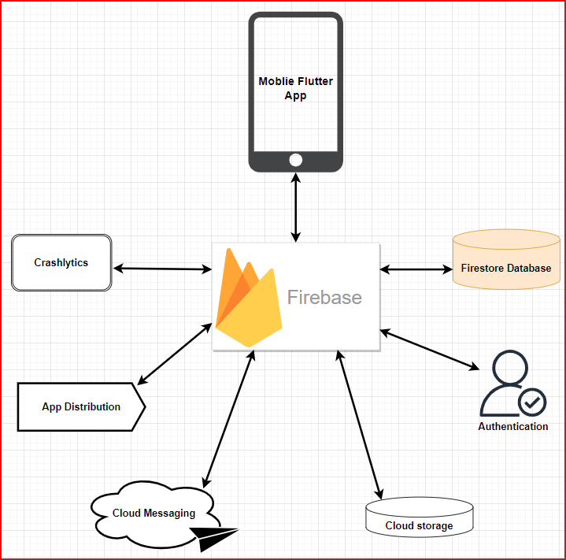
## Database diagram

- [Link db diagram](https://www.mermaidchart.com/raw/24090596-233c-45b9-874c-ea799eb720a4?theme=light&version=v0.1&format=svg)


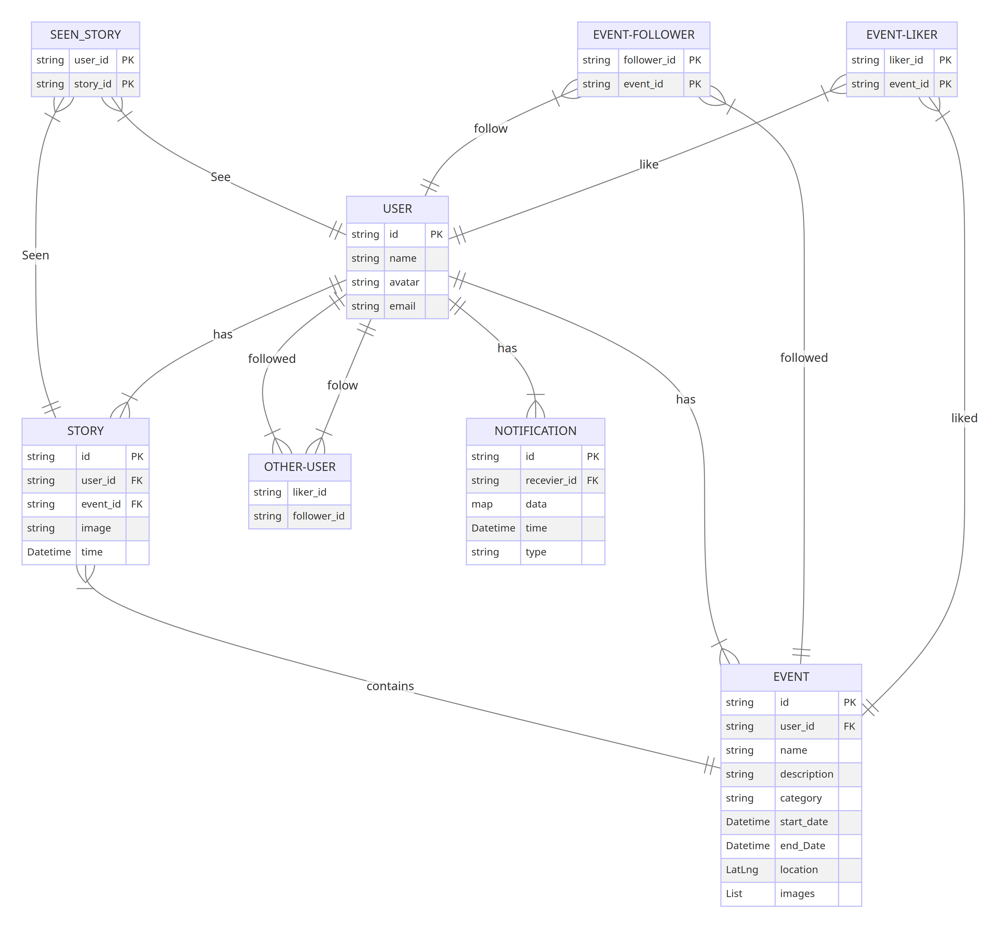

## Screenshot

| Login                                              | Signup                                              | 
| ---------------------------------------------------- | ---------------------------------------------------- | 
|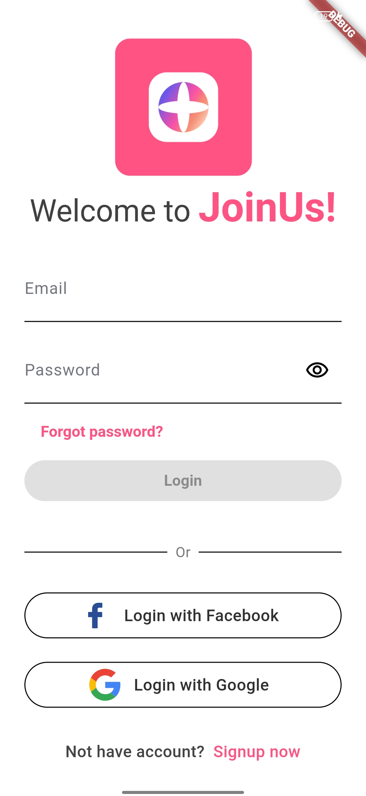 |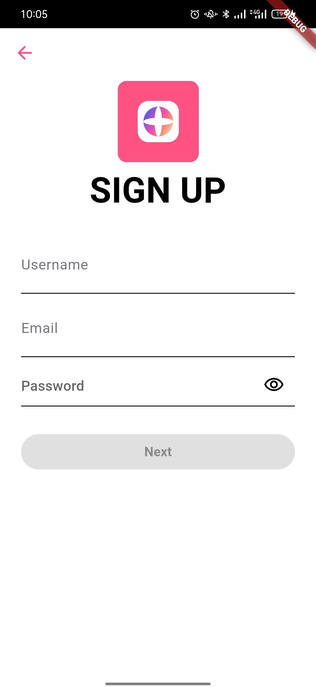| 

|Home                                                 |Post story                                                  |                     View story                                                  |
| ---------------------------------------------------- | ----------------------------------------------------   | --------------------------------------------------     |
| 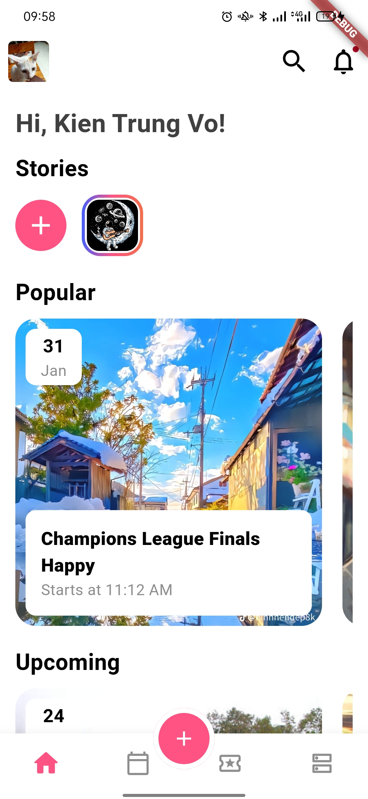| 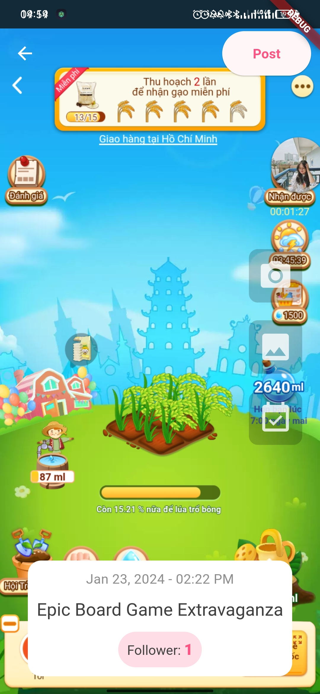| 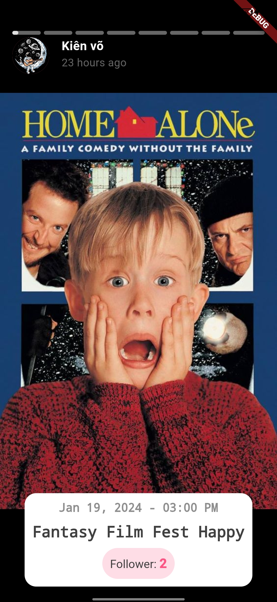|

|Search                                                 |Followed                                                  |                     Notification                                                  |
| ---------------------------------------------------- | ----------------------------------------------------   | --------------------------------------------------     |
| 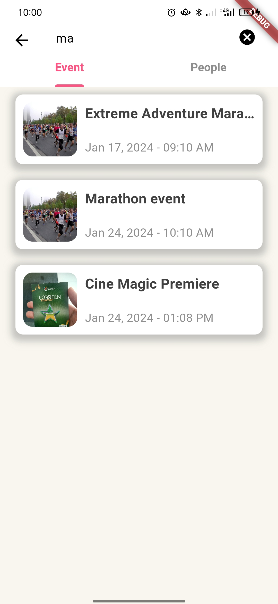| 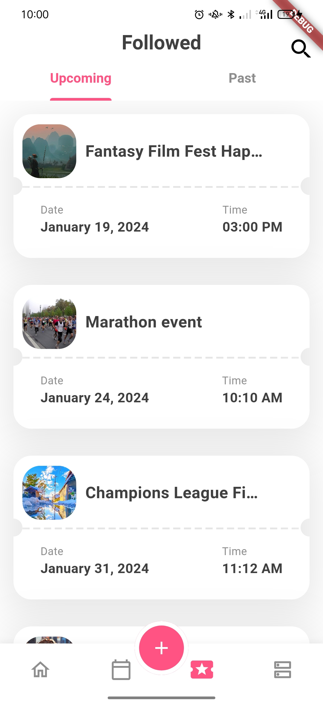| 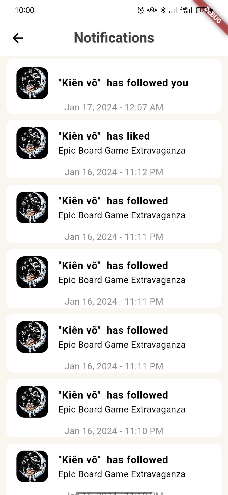|

|Detail event                                                 |Profile person                                                                     |
| ---------------------------------------------------- | ----------------------------------------------------   | 
| 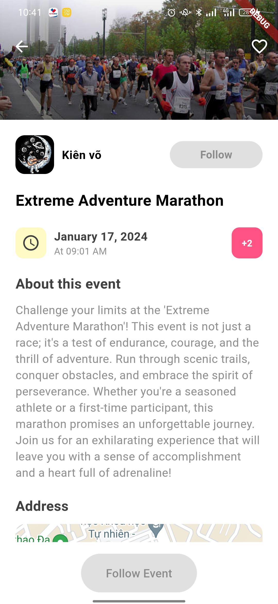| | 


- Filter event
<p float="left">
 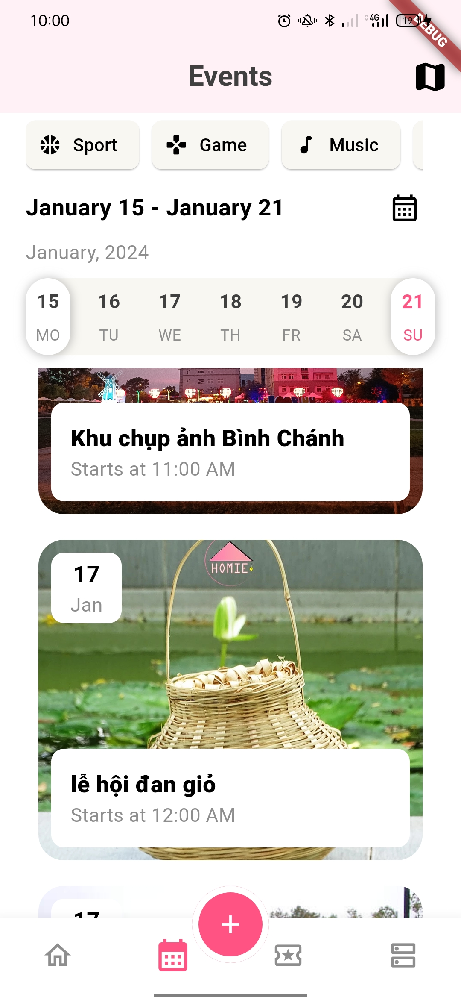
 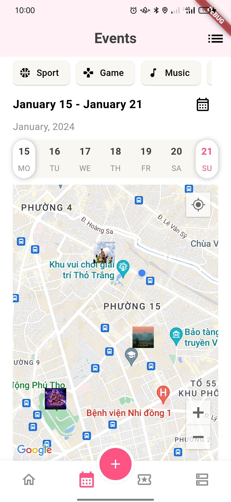
</p>


- Add event
<p float="left">
 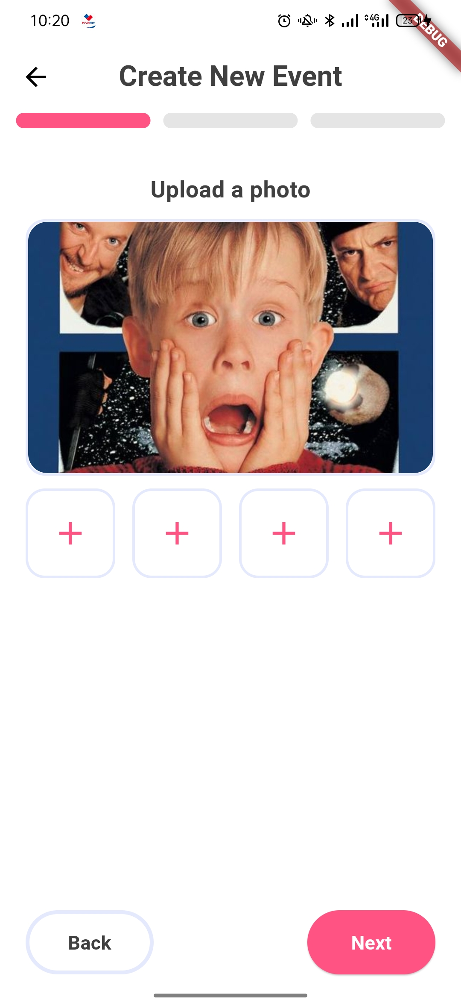
 
 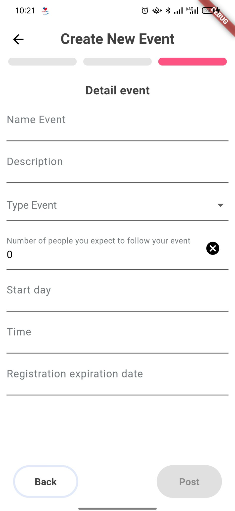
</p>


- Profile
<p float="left">
 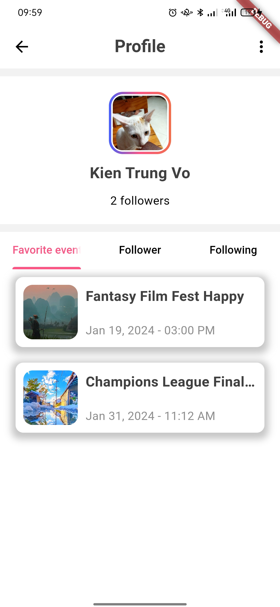
 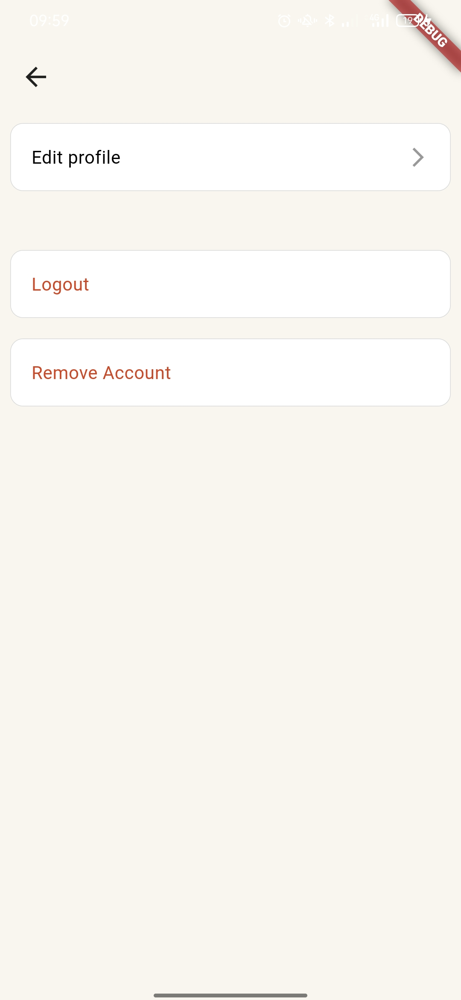
 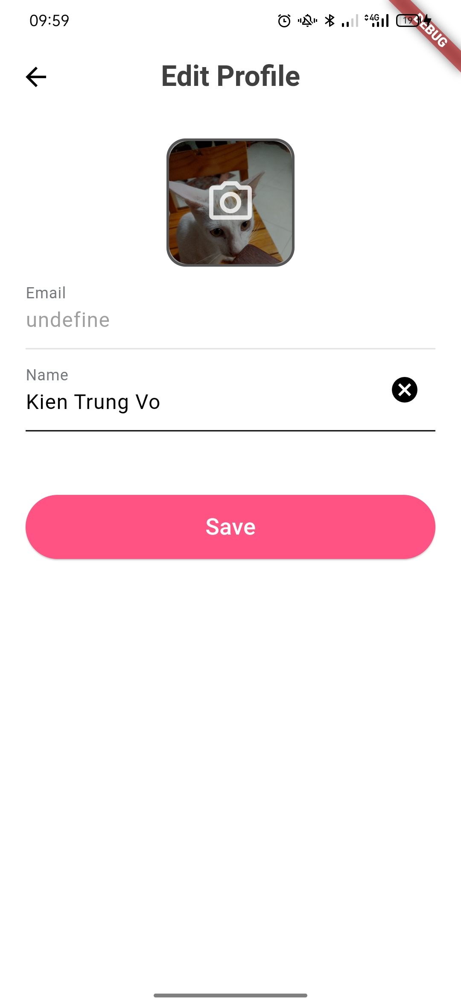
</p>

- Event management
<p float="left">
 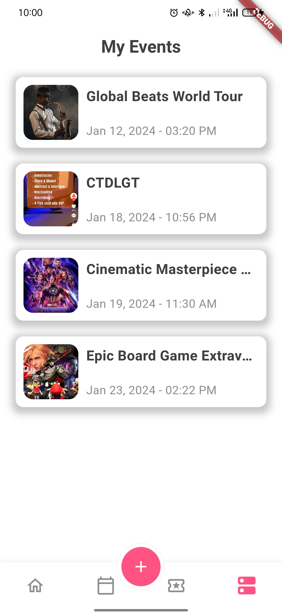
 
 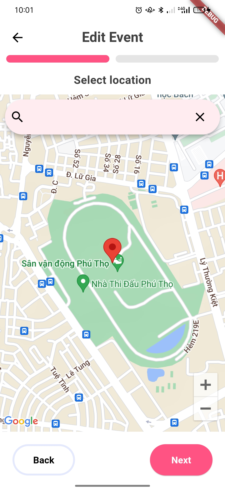
 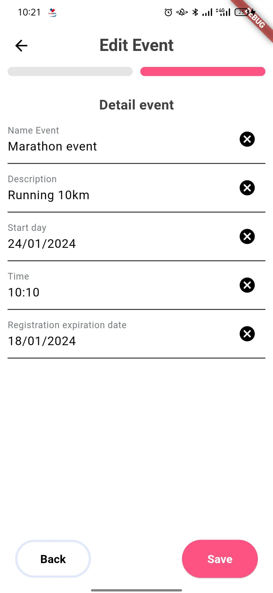
</p>
